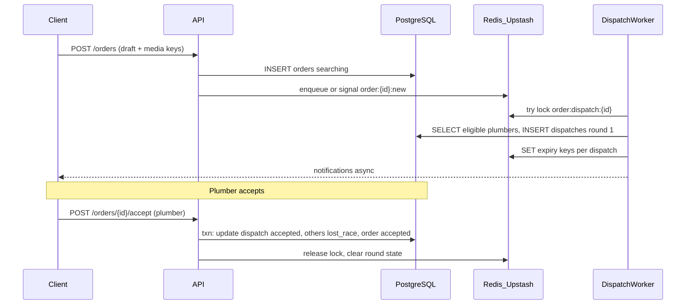

# Implementation 003 — Orders, dispatch rounds, plumber tokens, and Redis (Upstash)

**Purpose:** Step-by-step guide to implement **client order requests** (problem selection, description, optional photos), **multi-round dispatch** (top 3 plumbers, time-limited offers, repeat until acceptance or exhaustion), a **plumber token (points) system** that affects **matching and emergency eligibility**, and **Redis (Upstash)** alongside **PostgreSQL** for robustness.

**Prerequisites:** Complete the **relational schema** in [implementation_003_domain_modeling.md](./implementation_003_domain_modeling.md) (or have equivalent migrations in `apps/api/migrations/`). This document **extends** that model with new tables/columns and describes **runtime behavior**—not a second competing schema.

**Stack assumption:** API remains **Rust + PostgreSQL** unless you have moved to Node; **Redis** is **Upstash** (HTTP REST or standard Redis protocol). Same patterns work with self-hosted Redis.

---

## 1. Product summary

### 1.1 Client flow

1. Authenticated **client** chooses **service category** (and optional geography hints).
2. Enters **free-text problem description** (required detail).
3. Optionally **uploads one or more images** (presigned object storage → attach metadata in DB).
4. Confirms **address** (structured city/area/street + line) and **map pin** (`lat`/`lng`), **urgency** (`normal` | `urgent` | `emergency`).
5. Submits → creates **`orders`** row in **`searching`**, then dispatch subsystem runs.

### 1.2 Dispatch flow (standard urgency)

1. **Matcher** selects up to **3** eligible plumbers (see §5), creates **`order_dispatches`** rows for **round 1** with `sent` + `sent_at`, notifies plumbers (push/SMS later—out of scope for v1 transport).
2. Each offer is valid for **30 minutes** from **`sent_at`** (configurable).
3. **First plumber to accept** wins: order → **`accepted`**, other open dispatches for that order → **`lost_race`** (or **`expired`** if timer fires first).
4. If **no acceptance** before all round-1 offers **expire/reject**, start **round 2**: pick **next 3** plumbers **not yet contacted** for this order, repeat.
5. Continue until **accepted** or **no eligible plumbers left** → order **`expired`** or **`cancelled`** by policy (document product choice).

### 1.3 Emergency flow

- **Response window:** **10 minutes** per offer round (configurable).
- **Eligible plumbers:** only those meeting a **minimum token balance** (and usual approval/online/available/service/area rules) may receive **emergency** offers.
- **Pricing:** emergency orders may use **higher price band** (`service_price_guides` with `is_emergency_supported` + UI copy); settlement logic is later—schema already has `urgency` and estimate fields.

### 1.4 Token (points) rules

| Event | Tokens | Notes |
|-------|--------|--------|
| Order **completed** successfully | **+1** | Credit **after** transition to `completed` (idempotent per order). |
| **Speed bonus** | **+2** | If the **accepted** plumber’s winning dispatch: `responded_at - sent_at` ≤ **30 minutes** (same window as standard offer TTL; configurable). |
| **Future** (optional) | negative adjustments | No-shows, abuse—**admin** or automated rules via ledger only. |

**Important:** Use an **append-only ledger** + **deterministic rules** so balances are auditable and replayable. Do **not** only mutate a counter without history.

---

## 2. Schema extensions (migrations after core 003)

Add these in **new migrations** after `orders` / `order_dispatches` exist.

### 2.1 `order_dispatches` — offer rounds

Add **`offer_round`** `SMALLINT NOT NULL DEFAULT 1` (or `round_number`).

- **Semantics:** Round 1 = first batch of up to 3; round 2 = next batch, etc.
- **Constraint:** Unique stays **`(order_id, plumber_id)`** — a plumber appears at most once per order across all rounds.
- **Index:** `(order_id, offer_round)` for listing active round.

### 2.2 `order_media` (or `order_attachments`)

| Column | Type | Notes |
|--------|------|--------|
| `id` | UUID PK | |
| `order_id` | UUID NOT NULL | → `orders.id` **ON DELETE CASCADE** |
| `storage_key` | TEXT NOT NULL | S3/R2 key or path |
| `content_type` | TEXT NOT NULL | `image/jpeg`, etc. |
| `byte_size` | INTEGER NOT NULL | |
| `sort_order` | SMALLINT NOT NULL DEFAULT 0 | |
| `created_at` | TIMESTAMPTZ | |

**Index:** `(order_id, sort_order)`.

**Flow:** API returns **presigned PUT URL**; client uploads; client calls **attach** with `storage_key` + metadata; server verifies object exists (optional) and inserts row.

### 2.3 Token ledger

**Enum** `token_ledger_reason`:

- `order_completed`
- `speed_bonus`
- `admin_adjustment`
- (reserve values for future penalties)

**Table** `plumber_token_ledger`:

| Column | Type | Notes |
|--------|------|--------|
| `id` | UUID PK | |
| `plumber_id` | UUID NOT NULL | → `plumber_profiles.id` **ON DELETE CASCADE** |
| `delta` | INTEGER NOT NULL | +1, +2, -3, … |
| `reason` | `token_ledger_reason` NOT NULL | |
| `order_id` | UUID NULL | → `orders.id` **ON DELETE SET NULL** — set for completion/speed rows |
| `idempotency_key` | TEXT NULL **UNIQUE** | e.g. `order:{uuid}:completion`, `order:{uuid}:speed:{plumber_id}` — prevents double credit |
| `meta` | JSONB NULL | |
| `created_at` | TIMESTAMPTZ NOT NULL DEFAULT now() | |

**Indexes:** `(plumber_id, created_at DESC)`, `(order_id)` where not null.

**Denormalized balance (optional but recommended for hot path):**

- Add **`plumber_profiles.token_balance`** `INTEGER NOT NULL DEFAULT 0`, updated in the **same transaction** as ledger insert.
- **Reconciliation job** (daily): `SUM(delta)` per plumber vs `token_balance`; alert on mismatch.

### 2.4 Platform settings (config in DB)

**Table** `platform_settings` (key-value, typed) or a single JSONB row:

- `dispatch_offer_ttl_minutes_normal` (default 30)
- `dispatch_offer_ttl_minutes_emergency` (default 10)
- `dispatch_batch_size` (default 3)
- `emergency_min_token_balance` (default e.g. 10—tune with product)
- `speed_bonus_window_minutes` (default 30, align with standard TTL)

**Alternative:** environment variables for v1; move to DB when admins need UI.

---

## 3. PostgreSQL vs Redis — division of responsibility

| Concern | PostgreSQL (source of truth) | Redis (Upstash) |
|---------|-------------------------------|-----------------|
| Order + dispatch rows | Yes | No |
| Token **ledger** + balances | Yes | Optional **read cache** of `token_balance` with TTL |
| **Offer expiry time** | `sent_at` + TTL in app | **TTL key** `dispatch:expiry:{dispatch_id}` mirrors deadline for worker |
| **Distributed lock** “extend round / assign batch” | Serializable txn + `SELECT … FOR UPDATE` on `orders` | **`SET key NX EX`** lock `order:dispatch:{order_id}` |
| **Idempotency** on webhooks / retries | `idempotency_key` on ledger | `SET idemp:{key} 1 EX 86400 NX` for API idempotency |
| **Rate limits** (per plumber notifications) | — | counters with expiry |
| **Pub/Sub** to workers | LISTEN/NOTIFY possible | Upstash REST: prefer **polling worker** or **QStash**/queue product if you add it later |

**Robustness principle:** If Redis is **down**, dispatch can still run using **DB-only** paths (timers from `sent_at`, cron scanning `order_dispatches` where `status = 'sent'` and `now() > sent_at + interval`). Redis is an **accelerator and lock helper**, not the only brain—unless you explicitly choose otherwise later.

---

## 4. High-level architecture

---

## 5. Matching algorithm (v1 outline)

**Input:** `orders` row (category, city/area, lat/lng, urgency).

**Hard filters (SQL):**

1. `plumber_profiles.is_approved = true`, `is_online`, `is_available`.
2. `plumber_services` contains `service_category_id`.
3. `plumber_service_areas` allows **city** (and **area** if order has `area_id`).
4. `last_location_updated_at` within **staleness threshold** (e.g. 15 min)—configurable.
5. **Distance:** Haversine in query or pre-filter by **bounding box** then sort in app; `distance_km ≤ service_radius_km`.
6. **Emergency:** `plumber_profiles.token_balance ≥ emergency_min_token_balance`.

**Strict then city-wide (v1):** The matcher runs this **strict** SQL first (including distance `≤ service_radius_km` and area rules where applicable). If that pass returns **no** candidates, the API runs **one** city-wide fallback pass—same category, online/approved, staleness, and exclusions, but relaxed geography per [Implementation 004 §4.3](../implementation_004_dispatch_queue/implementation_004_dispatch_queue_redis_postgres.md#43-city-wide-fallback-when-strict-match-finds-no-one)—without merging the two result sets.

**Ranking score (example):**

\[
\text{score} = w_t \cdot \text{normalize}(\text{token\_balance}) + w_r \cdot \text{rating\_avg} + w_d \cdot \frac{1}{1 + \text{distance\_km}}
\]

Weights \(w_t, w_r, w_d\) are config. **Higher token holders** surface first; tie-break with rating and distance.

**Exclusions:**

- Plumbers already in **`order_dispatches`** for this `order_id` (any round).
- Plumbers **blocked** by admin (future `plumber_blocks` table) if you add it.

**Batch:** Take top **N** = `dispatch_batch_size` (default 3).

---

## 6. State machine notes

### 6.1 Order (`order_status`)

- Create → **`searching`**.
- When first batch sent → can stay **`searching`** or move to **`dispatched`** (pick one convention and stick to it; recommend **`dispatched`** once any `order_dispatches` row exists).
- On accept → **`accepted`** → then **`in_progress`** → **`completed`**.
- Client/admin cancel → **`cancelled`**.
- No plumbers / policy timeout → **`expired`**.

### 6.2 Dispatch (`dispatch_status`)

- **`sent`** → **`viewed`** (optional, when app opens offer).
- **`sent`** → **`accepted`** (winner).
- **`sent`** → **`rejected`** | **`expired`** (timeout or explicit decline).
- Non-winners after someone accepts → **`lost_race`**.
- Worker must run **`UPDATE … WHERE order_id = ? AND status = 'sent'`** in one transaction with **`FOR UPDATE`** to avoid double acceptance.

### 6.3 Token credits (on `completed`)

In the **same transaction** as setting `orders.status = 'completed'`:

1. Insert ledger `reason = order_completed`, `delta = +1`, `idempotency_key = order:{id}:completion`.
2. If `speed_bonus` applies (winning dispatch `responded_at - sent_at ≤ speed_bonus_window`):
   - Insert second row `reason = speed_bonus`, `delta = +2`, `idempotency_key = order:{id}:speed:{plumber_id}`.
3. Update **`plumber_profiles.token_balance`** += sum of deltas.

If insert conflicts on **`idempotency_key`**, skip (already processed).

---

## 7. Redis key conventions (suggested)

| Key pattern | Purpose | TTL |
|-------------|---------|-----|
| `order:dispatch:lock:{order_id}` | Single writer for round advancement | 30 s renew or release |
| `dispatch:deadline:{dispatch_id}` | String ISO timestamp or “1”; optional | match offer TTL |
| `idemp:api:{key}` | HTTP idempotency | 24 h |
| `plumber:tokens:{plumber_id}` | Cache of balance | 60 s (invalidate on ledger write) |

Use **hash tags** in cluster mode if you ever shard: `{order_id}:…`.

---

## 8. API surface (incremental)

Implement in **phases**; paths are illustrative.

| Phase | Method | Path | Role |
|-------|--------|------|------|
| A | `POST` | `/orders/presign` | Client — presigned upload for media |
| A | `POST` | `/orders` | Client — create order + attach `order_media` keys |
| A | `GET` | `/orders/{id}` | Client / assigned plumber / admin |
| B | `POST` | `/orders/{id}/dispatches/{dispatch_id}/accept` | Plumber |
| B | `POST` | `/orders/{id}/dispatches/{dispatch_id}/reject` | Plumber |
| C | `POST` | `/internal/dispatch/tick` or worker cron | System — scan due work (protect with auth/secret) |

**Authorization:** Enforce **client** owns order; **plumber** only their dispatch row; **admin** read-all.

---

## 9. Workers and scheduling

**Option 1 — Cron + DB polling (simplest):** Every minute, query `order_dispatches` where `status = 'sent'` and `sent_at + ttl < now()` → set **`expired`**, then call **“advance round”** for parent order if still `searching`/`dispatched` and no accept.

**Option 2 — Redis TTL + callback:** Not native on Upstash like keyspace notifications in classic Redis; use **QStash** scheduled HTTP hook or stick to **Option 1**.

**Option 3 — Queue message per dispatch:** Enqueue “expire at T” in **Upstash QStash** hitting your API — good for scale; more moving parts.

**Recommendation for v1:** **Option 1** + optional **Redis lock** when advancing round to avoid double work across API replicas.

---

## 10. Step-by-step implementation plan

### Phase OD-0 — Schema

1. Add migrations: **`order_media`**, **`offer_round`** on **`order_dispatches`**, **`plumber_token_ledger`**, **`token_ledger_reason`**, optional **`plumber_profiles.token_balance`**, **`platform_settings`**.
2. Backfill **`token_balance = 0`** for existing plumbers.
3. Run verification queries from [implementation_003_domain_modeling.md §12](./implementation_003_domain_modeling.md) plus ledger unique constraints.

### Phase OD-1 — Create order (API)

1. Validate client role, category, geography IDs, lat/lng, urgency.
2. Insert **`orders`** (`searching`).
3. Insert **`order_media`** rows from validated `storage_key` list.
4. Commit; emit **internal event** (in-process channel, or insert **`outbox`** table for later—optional).

### Phase OD-2 — Matcher (library + tests)

1. Pure function or SQL: **eligible plumbers** for an order.
2. Unit tests: filters, emergency token threshold, exclusion of already-dispatched plumbers.
3. Deterministic ordering tests for **same inputs → same top 3** (stable sort).

### Phase OD-3 — Dispatch writer

1. Transaction: **`FOR UPDATE`** on `orders` row.
2. If not in dispatchable state, return.
3. Compute next **`offer_round`** = `MAX(offer_round)+1` or 1.
4. Insert up to 3 **`order_dispatches`** (`sent`, `sent_at = now()`, `dispatch_rank`, `offer_round`).
5. Update order status to **`dispatched`** if appropriate.
6. Optionally set Redis lock/expiry keys.

### Phase OD-4 — Accept / reject

1. **Accept:** txn verifies dispatch `sent`, same plumber as auth, order still open; set dispatch **`accepted`**, others **`lost_race`**, order **`accepted`**, set `accepted_at`, `assigned_plumber_id`.
2. **Reject:** dispatch **`rejected`**, `responded_at = now()`; if no other **`sent`** in current round, optionally trigger **advance round** (or wait for cron expiry for stricter semantics).

### Phase OD-5 — Expiry + next round

1. Job marks **`expired`** dispatches past TTL.
2. If order still has no **`accepted`** dispatch and eligible plumbers remain, call **Dispatch writer** for next round.
3. If none left, set order **`expired`**.

### Phase OD-6 — Completion + tokens

1. When order → **`completed`**, run **ledger inserts** + **balance update** with **idempotency keys** (§6.3).
2. Optionally invalidate Redis **`plumber:tokens:{id}`**.

### Phase OD-7 — Observability

1. Structured logs: `order_id`, `offer_round`, `plumber_id`, transition.
2. Metrics: time-to-first-offer, time-to-accept, rounds per order, token grants count.

### Phase OD-8 — Client UI contract

1. Document payload for **create order** (category, text, media IDs, address, pin, urgency).
2. Plumber **inbox** lists **`order_dispatches`** where `plumber_id = me` and `status in ('sent','viewed')` with **countdown** from `sent_at` + TTL from settings.

---

## 11. Edge cases checklist

- [ ] **Double accept:** unique partial index or txn lock prevents two winners.
- [ ] **Order cancelled** while offers outstanding: set all **`sent`** dispatches to **`expired`** or **`cancelled`** sub-state (if you extend enum).
- [ ] **Plumber goes offline** after `sent`: still can accept until expiry; optional **revoke** is product-specific.
- [ ] **Clock skew:** use **server** `now()` only; clients show countdown from server-provided **`deadline_at`** ISO field in API response.
- [ ] **Replay of completion:** **`idempotency_key`** on ledger prevents duplicate token grants.

---

## 12. Relation to future specs

- **Implementation 004** — [**Dispatch work queue (Redis + PostgreSQL SOT)**](../implementation_004_dispatch_queue/implementation_004_dispatch_queue_redis_postgres.md): auto-start first-round matching after `POST /orders` without blocking the HTTP handler.
- **Later (Dispatch / platform)** — **matching v2** (ML, traffic), **notifications**, **maps**, **real-time** (WebSocket/SSE).
- **Implementation 005 (Admin)** — **token adjustments**, **fraud review**, **settings UI** for TTLs and thresholds (numbers are illustrative until locked).

---

## 13. Verification (this feature set)

- [ ] Create order with 2 images; media rows linked; order **`searching`**.
- [ ] Matcher returns ≤3 plumbers; second round excludes round-1 plumbers.
- [ ] Accept within TTL → order **`accepted`**; others **`lost_race`**.
- [ ] Let TTL pass → dispatches **`expired`**; round 2 created if plumbers available.
- [ ] Emergency order: plumber below token threshold **never** appears in matcher output.
- [ ] Complete order → ledger +1; fast accept → +2 additional row; **`idempotency_key`** blocks duplicate on retry.
- [ ] Redis unavailable → cron expiry + round advance still works (DB-only path tested).

---

*This guide is the operational companion to the static schema in `implementation_003_domain_modeling.md`. When the schema and this doc diverge, update **both** in the same PR.*
